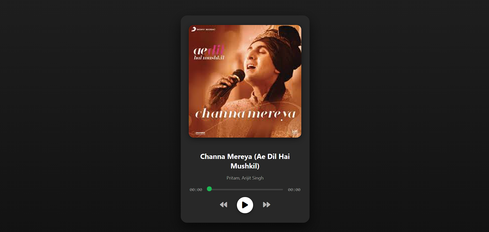

# 🎵 Now Playing - Arijit Singh

A stylish and responsive music player web interface featuring the song **"Channa Mereya"** by **Arijit Singh**, designed using HTML, CSS, and JavaScript. This mini-project replicates a sleek, card-style music player with audio control functionality.

---

## 🌐 Demo

Play, pause, seek, and explore a clean and elegant music player experience.

---
## 📸 Screenshot


## 📁 Project Structure
music-player/
├── index.html # Main HTML file
├── style.css # External CSS
├── script.js # JavaScript for player functionality
├── img/
│ ├── download.jpeg # Artist image
│ └── adhm.mp3 # Audio file for the song


---

## 🚀 Features

- 🎨 Elegant and responsive UI  
- 🎵 Embedded audio player  
- ▶️ Play / Pause toggle button  
- ⏮️ Previous and ⏭️ Next buttons (dummy alerts for demo)  
- ⏱️ Display of current time and duration  
- 🎚️ Interactive progress bar for seeking  
- 🔥 Hover effects and animated buttons  

---

## 🛠️ Technologies Used

- **HTML5** – Semantic markup structure  
- **CSS3** – Gradient background, flexbox layout, custom sliders  
- **JavaScript** – Audio controls, event handling  
- **Font Awesome** – Icon fonts for control buttons  

---

## 📦 How to Use

1. Clone or download this repository:
   ```bash
   git clone https://github.com/your-username/music-player.git
